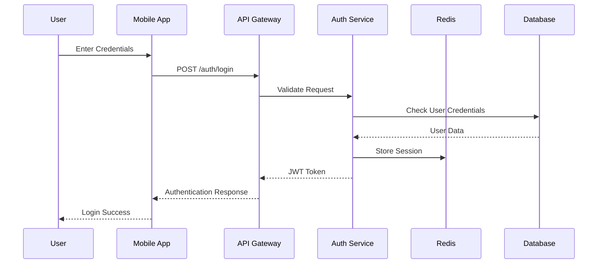
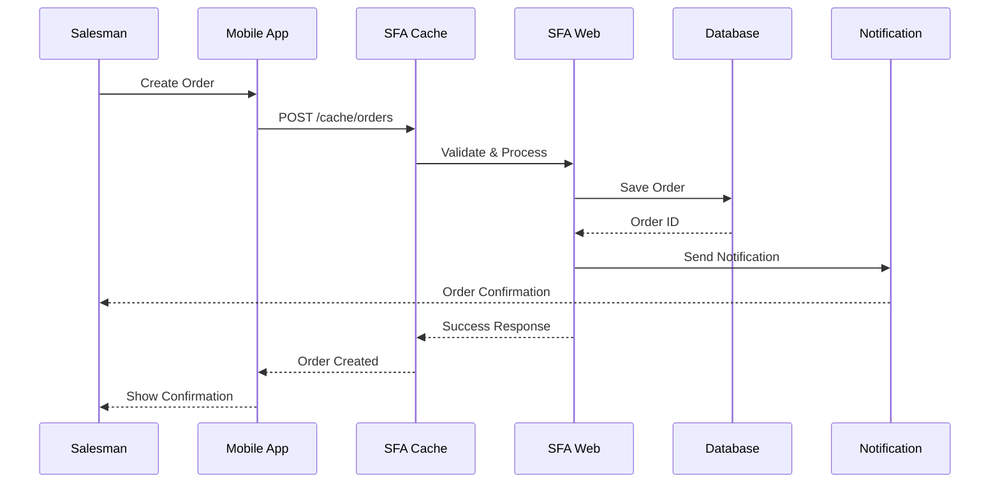
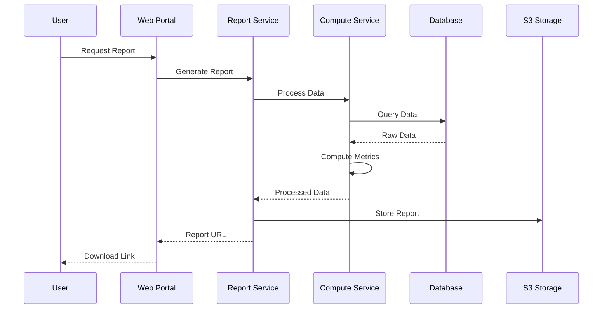

# Marico Supervisor Java - Architecture Design & Flow

## 📋 Table of Contents
1. [Project Overview](#project-overview)
2. [System Architecture](#system-architecture)
3. [Microservices Architecture](#microservices-architecture)
4. [Technology Stack](#technology-stack)
5. [Database Architecture](#database-architecture)
6. [API Architecture](#api-architecture)
7. [Security Architecture](#security-architecture)
8. [Deployment Architecture](#deployment-architecture)
9. [Data Flow Diagrams](#data-flow-diagrams)
10. [Integration Patterns](#integration-patterns)
11. [Getting Started Guide](#getting-started-guide)

---

## 🎯 Project Overview

**Marico Supervisor Java** is a comprehensive Sales Force Automation (SFA) system designed for Marico Limited. It's a microservices-based enterprise application that manages sales operations, distributor relationships, inventory management, and reporting for field sales teams.

### Key Business Functions:
- **Sales Management**: Order processing, customer management, sales tracking
- **Inventory Control**: Stock management, ledger tracking, distributor inventory
- **Field Operations**: Route planning, attendance tracking, task management
- **Analytics & Reporting**: Sales reports, performance dashboards, KPI tracking
- **Mobile Integration**: Mobile app support for field sales representatives

---

## 🏗️ System Architecture

### High-Level Architecture Diagram

```
┌─────────────────────────────────────────────────────────────────┐
│                    PRESENTATION LAYER                           │
├─────────────────┬─────────────────┬─────────────────────────────┤
│   Mobile Apps   │   Web Portal    │    Admin Dashboard          │
│   (Android/iOS) │   (Angular)     │    (Management Interface)   │
└─────────────────┴─────────────────┴─────────────────────────────┘
                            │
                    ┌───────┴───────┐
                    │  Load Balancer │
                    │   (AWS ALB)    │
                    └───────┬───────┘
                            │
┌─────────────────────────────────────────────────────────────────┐
│                    API GATEWAY LAYER                            │
├─────────────────────────────────────────────────────────────────┤
│              Spring Boot API Gateway                            │
│           (Request Routing & Authentication)                    │
└─────────────────────────────────────────────────────────────────┘
                            │
┌─────────────────────────────────────────────────────────────────┐
│                  MICROSERVICES LAYER                            │
├──────────┬──────────┬──────────┬──────────┬──────────┬─────────┤
│ SFA Web  │SFA Cache │ InterDB  │ Reports  │ Compute  │ Common  │
│   9003   │   9004   │   9005   │   9006   │   9007   │ Library │
├──────────┼──────────┼──────────┼──────────┼──────────┼─────────┤
│File Proc │Notificat │ActionTrk │Standard  │FootSeq   │DataExp  │
│   9008   │   9009   │   9010   │   API    │   9011   │  9012   │
└──────────┴──────────┴──────────┴──────────┴──────────┴─────────┘
                            │
┌─────────────────────────────────────────────────────────────────┐
│                    DATA ACCESS LAYER                            │
├─────────────────┬─────────────────┬─────────────────────────────┤
│   Primary DB    │  Secondary DB   │      Cache Layer            │
│   (MySQL)       │   (MySQL)       │      (Redis)                │
│   Port: 3306    │   Port: 3306    │      Port: 6379             │
└─────────────────┴─────────────────┴─────────────────────────────┘
                            │
┌─────────────────────────────────────────────────────────────────┐
│                 EXTERNAL INTEGRATIONS                           │
├─────────────────┬─────────────────┬─────────────────────────────┤
│   AWS Services  │   Third Party   │    Legacy Systems           │
│   (S3, SES)     │   APIs (SMS)    │    (ERP, CRM)              │
└─────────────────┴─────────────────┴─────────────────────────────┘
```

---

## 🔧 Microservices Architecture

### Core Microservices

| Service | Port | Purpose | Key Features |
|---------|------|---------|--------------|
| **sfaweb** | 9003 | Main Web API | User management, Master data, Transactions |
| **sfacache** | 9004 | Caching & Mobile API | Redis caching, Mobile app endpoints |
| **interdb** | 9005 | Inter-DB Operations | Cross-database operations, Data sync |
| **sfareport** | 9006 | Reporting Engine | Report generation, Analytics |
| **sfareportcompute** | 9007 | Report Computing | Background report processing |
| **actiontracker** | 9010 | Activity Tracking | User actions, Audit trails |
| **fileprocessor** | 9008 | File Operations | File upload/download, Processing |
| **notification** | 9009 | Notifications | SMS, Email, Push notifications |
| **standardapi** | - | Standard APIs | Common API endpoints |
| **footsequence** | 9011 | Route Planning | Sales route optimization |
| **dataexporter** | 9012 | Data Export | Data export utilities |
| **standalone-compute** | - | Batch Processing | Scheduled computations |
| **csngweb** | - | CSNG Integration | Consumer goods integration |

### Supporting Libraries

| Library | Purpose |
|---------|---------|
| **common** | Shared utilities, constants, models |
| **interdbentity** | Inter-database entity models |
| **sfadbentity** | SFA database entity models |
| **sfadbrepository** | Data access layer, Repository pattern |

---

## 💻 Technology Stack

### Backend Technologies
```yaml
Framework: Spring Boot 3.1.3
Language: Java 17+
Build Tool: Gradle 8.2.1
Database: MySQL 8.0.33
Cache: Redis
Message Queue: (Configurable)
```

### Key Dependencies
```yaml
Spring Components:
  - Spring Boot Starter Web
  - Spring Boot Starter JDBC
  - Spring Boot Starter Validation
  - Spring Boot Starter Data Redis
  - Spring Boot Starter Mail
  - Spring Boot Starter Actuator

AWS Integration:
  - AWS SDK S3: 1.12.470
  - AWS QuickSight

Utilities:
  - Apache POI (Excel processing)
  - Apache HttpClient 5
  - Jackson (JSON processing)
  - Lombok (Code generation)
  - JWT Authentication
```

### Frontend Technologies
```yaml
Web Portal: Angular (ETL Web Portal)
Mobile: Android/iOS (Native apps)
Documentation: SpringDoc OpenAPI
```

---

## 🗄️ Database Architecture

### Database Structure

```
┌─────────────────────────────────────────────────────────────────┐
│                    DATABASE ARCHITECTURE                        │
├─────────────────────────────────────────────────────────────────┤
│                                                                 │
│  ┌─────────────────┐    ┌─────────────────┐                    │
│  │   PRIMARY DB    │    │  SECONDARY DB   │                    │
│  │ marico_supervisor│    │ marico_supervisor│                   │
│  │                 │    │                 │                    │
│  │ ┌─────────────┐ │    │ ┌─────────────┐ │                    │
│  │ │Master Tables│ │    │ │Report Tables│ │                    │
│  │ │- Users      │ │    │ │- Sales Data │ │                    │
│  │ │- Products   │ │    │ │- Analytics  │ │                    │
│  │ │- Customers  │ │    │ │- KPI Data   │ │                    │
│  │ └─────────────┘ │    │ └─────────────┘ │                    │
│  │                 │    │                 │                    │
│  │ ┌─────────────┐ │    │ ┌─────────────┐ │                    │
│  │ │Transaction  │ │    │ │Computed     │ │                    │
│  │ │Tables       │ │    │ │Reports      │ │                    │
│  │ │- Orders     │ │    │ │- Dashboards │ │                    │
│  │ │- Inventory  │ │    │ │- Summaries  │ │                    │
│  │ └─────────────┘ │    │ └─────────────┘ │                    │
│  └─────────────────┘    └─────────────────┘                    │
│                                                                 │
│  ┌─────────────────────────────────────────────────────────────┐ │
│  │                    REDIS CACHE                              │ │
│  │                                                             │ │
│  │  ┌─────────────┐  ┌─────────────┐  ┌─────────────┐        │ │
│  │  │Session Data │  │Master Cache │  │Report Cache │        │ │
│  │  │- User Info  │  │- Products   │  │- Dashboard  │        │ │
│  │  │- Auth Token │  │- Customers  │  │- Analytics  │        │ │
│  │  └─────────────┘  └─────────────┘  └─────────────┘        │ │
│  └─────────────────────────────────────────────────────────────┘ │
└─────────────────────────────────────────────────────────────────┘
```

### Key Database Tables (Sample)
```sql
-- Example from the provided schema
CREATE TABLE `pjp_adherence_report_psr` (
  `CmpCode` varchar(10) NOT NULL,
  `DistrCode` varchar(50) NOT NULL,
  `sdCode` varchar(50) NOT NULL,
  `salesmanCode` varchar(50) NOT NULL,
  `date` date NOT NULL,
  `coveragedt` date NOT NULL,
  -- ... other fields
  PRIMARY KEY (`CmpCode`,`sdCode`,`DistrCode`,`coveragedt`)
);
```

---

## 🔌 API Architecture

### RESTful API Design

```
Base URLs:
┌─────────────────────────────────────────────────────────────────┐
│ Service          │ Base URL                                     │
├─────────────────────────────────────────────────────────────────┤
│ SFA Web          │ http://localhost:9003/sfaweb/controller      │
│ SFA Cache        │ http://localhost:9004/cache                  │
│ InterDB          │ http://localhost:9005/interdb               │
│ Reports          │ http://localhost:9006/reports               │
│ Action Tracker   │ http://localhost:9010/action/controller     │
└─────────────────────────────────────────────────────────────────┘
```

### API Patterns

#### 1. Standard CRUD Operations
```http
GET    /api/v1/customers           # List customers
GET    /api/v1/customers/{id}      # Get customer by ID
POST   /api/v1/customers           # Create customer
PUT    /api/v1/customers/{id}      # Update customer
DELETE /api/v1/customers/{id}      # Delete customer
```

#### 2. Business Operations
```http
POST   /api/v1/orders              # Create order
GET    /api/v1/orders/status/{id}  # Check order status
POST   /api/v1/inventory/sync      # Sync inventory
GET    /api/v1/reports/sales       # Generate sales report
```

#### 3. Authentication & Authorization
```http
POST   /api/v1/auth/login          # User login
POST   /api/v1/auth/refresh        # Refresh token
POST   /api/v1/auth/logout         # User logout
GET    /api/v1/auth/verify         # Verify token
```

---

## 🔐 Security Architecture

### Security Layers

```
┌─────────────────────────────────────────────────────────────────┐
│                    SECURITY ARCHITECTURE                        │
├─────────────────────────────────────────────────────────────────┤
│                                                                 │
│  ┌─────────────────────────────────────────────────────────────┐ │
│  │                 AUTHENTICATION LAYER                       │ │
│  │                                                             │ │
│  │  ┌─────────────┐  ┌─────────────┐  ┌─────────────┐        │ │
│  │  │JWT Tokens   │  │OAuth 2.0    │  │Session Mgmt │        │ │
│  │  │- Access     │  │- MSAL       │  │- Redis      │        │ │
│  │  │- Refresh    │  │- Azure AD   │  │- Timeout    │        │ │
│  │  └─────────────┘  └─────────────┘  └─────────────┘        │ │
│  └─────────────────────────────────────────────────────────────┘ │
│                                                                 │
│  ┌─────────────────────────────────────────────────────────────┐ │
│  │                 AUTHORIZATION LAYER                        │ │
│  │                                                             │ │
│  │  ┌─────────────┐  ┌─────────────┐  ┌─────────────┐        │ │
│  │  │Role-Based   │  │Resource     │  │Method Level │        │ │
│  │  │Access       │  │Protection   │  │Security     │        │ │
│  │  │Control      │  │             │  │             │        │ │
│  │  └─────────────┘  └─────────────┘  └─────────────┘        │ │
│  └─────────────────────────────────────────────────────────────┘ │
│                                                                 │
│  ┌─────────────────────────────────────────────────────────────┐ │
│  │                   DATA SECURITY                            │ │
│  │                                                             │ │
│  │  ┌─────────────┐  ┌─────────────┐  ┌─────────────┐        │ │
│  │  │Encryption   │  │Input        │  │SQL Injection│        │ │
│  │  │- At Rest    │  │Validation   │  │Prevention   │        │ │
│  │  │- In Transit │  │- Bean Valid │  │- Prepared   │        │ │
│  │  └─────────────┘  └─────────────┘  └─────────────┘        │ │
│  └─────────────────────────────────────────────────────────────┘ │
└─────────────────────────────────────────────────────────────────┘
```

### Security Features
- **JWT Authentication**: Stateless authentication with access/refresh tokens
- **MSAL Integration**: Microsoft Authentication Library for Azure AD
- **Input Validation**: Bean validation with Hibernate Validator
- **SQL Injection Prevention**: Parameterized queries and prepared statements
- **Session Management**: Redis-based session storage with timeout
- **HTTPS Enforcement**: SSL/TLS encryption for data in transit

---

## 🚀 Deployment Architecture

### Environment Setup

```
┌─────────────────────────────────────────────────────────────────┐
│                    DEPLOYMENT ARCHITECTURE                      │
├─────────────────────────────────────────────────────────────────┤
│                                                                 │
│  ┌─────────────────────────────────────────────────────────────┐ │
│  │                    PRODUCTION                               │ │
│  │                                                             │ │
│  │  ┌─────────────┐  ┌─────────────┐  ┌─────────────┐        │ │
│  │  │Load Balancer│  │Auto Scaling │  │Health Check │        │ │
│  │  │- AWS ALB    │  │- EC2 ASG    │  │- Actuator   │        │ │
│  │  │- SSL Term   │  │- Min: 2     │  │- Custom     │        │ │
│  │  └─────────────┘  └─────────────┘  └─────────────┘        │ │
│  └─────────────────────────────────────────────────────────────┘ │
│                                                                 │
│  ┌─────────────────────────────────────────────────────────────┐ │
│  │                      UAT/QA                                │ │
│  │                                                             │ │
│  │  ┌─────────────┐  ┌─────────────┐  ┌─────────────┐        │ │
│  │  │Single       │  │Test Data    │  │Monitoring   │        │ │
│  │  │Instance     │  │- Sanitized  │  │- Logs       │        │ │
│  │  │- EC2        │  │- Subset     │  │- Metrics    │        │ │
│  │  └─────────────┘  └─────────────┘  └─────────────┘        │ │
│  └─────────────────────────────────────────────────────────────┘ │
│                                                                 │
│  ┌─────────────────────────────────────────────────────────────┐ │
│  │                    DEVELOPMENT                              │ │
│  │                                                             │ │
│  │  ┌─────────────┐  ┌─────────────┐  ┌─────────────┐        │ │
│  │  │Local Setup  │  │Docker       │  │Hot Reload   │        │ │
│  │  │- IDE        │  │- Compose    │  │- DevTools   │        │ │
│  │  │- Embedded   │  │- Services   │  │- Live       │        │ │
│  │  └─────────────┘  └─────────────┘  └─────────────┘        │ │
│  └─────────────────────────────────────────────────────────────┘ │
└─────────────────────────────────────────────────────────────────┘
```

---

## 📊 Data Flow Diagrams

### 1. User Authentication Flow



### 2. Order Processing Flow



### 3. Report Generation Flow



---

## 🔄 Integration Patterns

### 1. Synchronous Integration
```java
// REST API calls between microservices
@Service
public class UserService {
    @Autowired
    private DAORepository repository;
    
    public List<SalesmanEntity> getDSRInfo(String deviceNo) {
        var params = new MapSqlParameterSource();
        params.addValue("imei", deviceNo);
        return repository.fetchData(QueryConstants.FETCH_SALESMAN, params, SalesmanEntity.class);
    }
}
```

### 2. Asynchronous Integration
```yaml
# Scheduled Jobs
Schedulers:
  - Report Generation: "0 31 14 * * ?"
  - Data Sync: "0 02 15 * * ?"
  - Notifications: "0 0/5 * * * *"
  - Stock Ledger: "0 25 19 * * ?"
```

### 3. Event-Driven Integration
```java
// Redis-based caching for real-time data
@Cacheable(value = "masterData", key = "#cmpCode")
public List<Configuration> getConfiguration(String cmpCode) {
    return repository.fetchData(QueryConstants.FETCH_CONFIGURATION, 
                               new MapSqlParameterSource(), Configuration.class);
}
```

---

## 🚀 Getting Started Guide

### Prerequisites
```bash
# Required Software
Java 17 or above
Gradle 8.2.1 or above
MySQL 8.0.33
Redis Server
Git
```

### 1. Environment Setup
```bash
# Clone the repository
git clone https://git-codecommit.ap-south-1.amazonaws.com/v1/repos/maricossfa
cd maricossfa/microservices

# Set Java Home
export JAVA_HOME=/usr/lib/jvm/java-17-openjdk-amd64
```

### 2. Database Setup
```sql
-- Create databases
CREATE DATABASE marico_supervisor_qa;
CREATE DATABASE marico_supervisor_reports;

-- Run migration scripts from documents/SFA Web/
-- Execute DBCR scripts in sequence
```

### 3. Configuration
```bash
# Update application.properties
cp config/application.properties config/application-local.properties

# Configure database connections
spring.datasource.url=jdbc:mysql://localhost:3306/marico_supervisor_qa
spring.datasource.username=your_username
spring.datasource.password=your_password

# Configure Redis
spring.redis.host=localhost
spring.redis.port=6379
```

### 4. Build & Run
```bash
# Build all microservices
./gradlew clean build -x test

# Run individual services
./gradlew :sfaweb:bootRun        # Port 9003
./gradlew :sfacache:bootRun      # Port 9004
./gradlew :interdb:bootRun       # Port 9005
./gradlew :sfareport:bootRun     # Port 9006
```

### 5. Verification
```bash
# Check service health
curl http://localhost:9003/version
curl http://localhost:9004/version

# Expected Response:
{
  "appName": "Marico SFA",
  "version": "1.0.0"
}
```

### 6. API Documentation
```bash
# Access Swagger UI (if enabled)
http://localhost:9003/swagger-ui.html
http://localhost:9004/swagger-ui.html
```

---

## 📈 Monitoring & Observability

### Health Checks
```yaml
Endpoints:
  - /actuator/health
  - /actuator/metrics
  - /actuator/prometheus
  - /version
```

### Logging
```yaml
Configuration:
  - File: appusage.log
  - Level: INFO (com.botree packages)
  - Format: Structured logging with correlation IDs
```

### Metrics
```yaml
Monitoring:
  - Application metrics via Micrometer
  - Prometheus integration
  - Custom business metrics
  - Database connection pool metrics
```

---

## 🔧 Development Guidelines

### Code Structure
```
src/main/java/com/botree/{service}/
├── controller/          # REST endpoints
├── service/            # Business logic
├── repository/         # Data access (if applicable)
├── model/             # DTOs and entities
├── config/            # Configuration classes
├── exception/         # Exception handling
└── util/              # Utility classes
```

### Best Practices
1. **Separation of Concerns**: Each microservice has a single responsibility
2. **Database per Service**: Each service manages its own data
3. **API Versioning**: Use versioned APIs for backward compatibility
4. **Error Handling**: Consistent error response format across services
5. **Security**: JWT-based authentication with proper validation
6. **Caching**: Redis for session management and frequently accessed data
7. **Monitoring**: Health checks and metrics for all services

---

## 📞 Support & Contact

**Development Team**: Botree Software International Pvt Ltd  
**License**: ©Botree Software International Pvt Ltd. All Rights Reserved  
**Documentation**: Refer to `/documents` folder for detailed API specifications

---

*This architecture document provides a comprehensive overview of the Marico Supervisor Java project. For specific implementation details, refer to the individual microservice documentation and API specifications.*