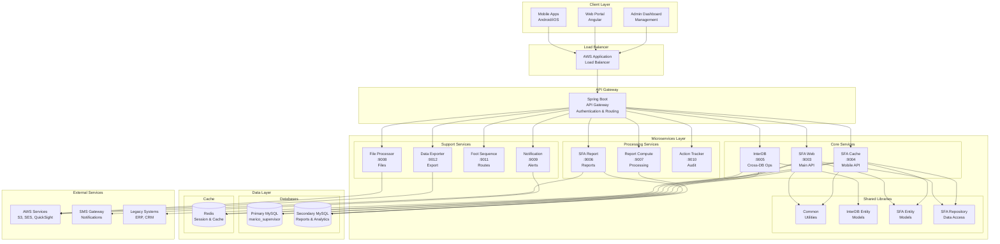
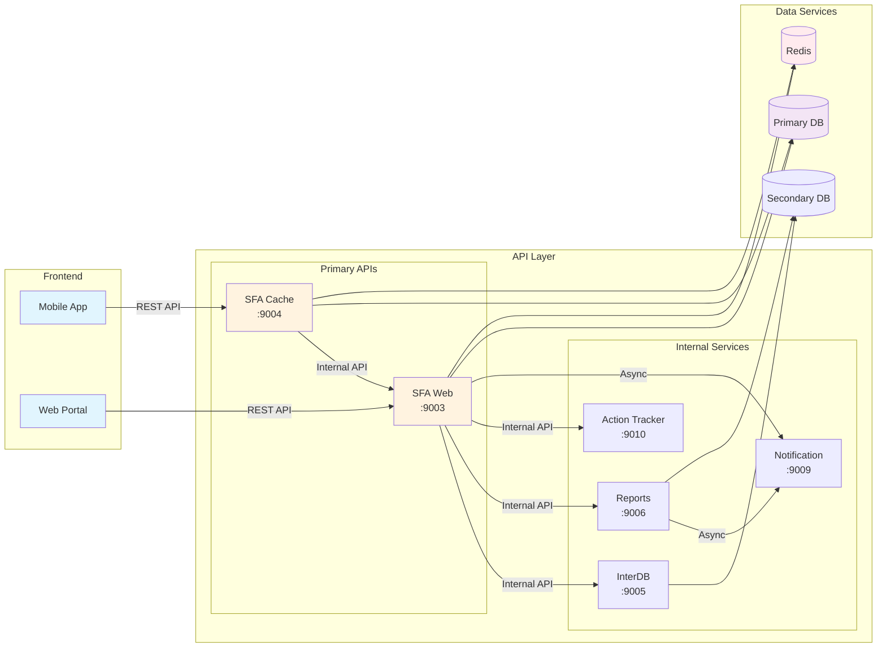
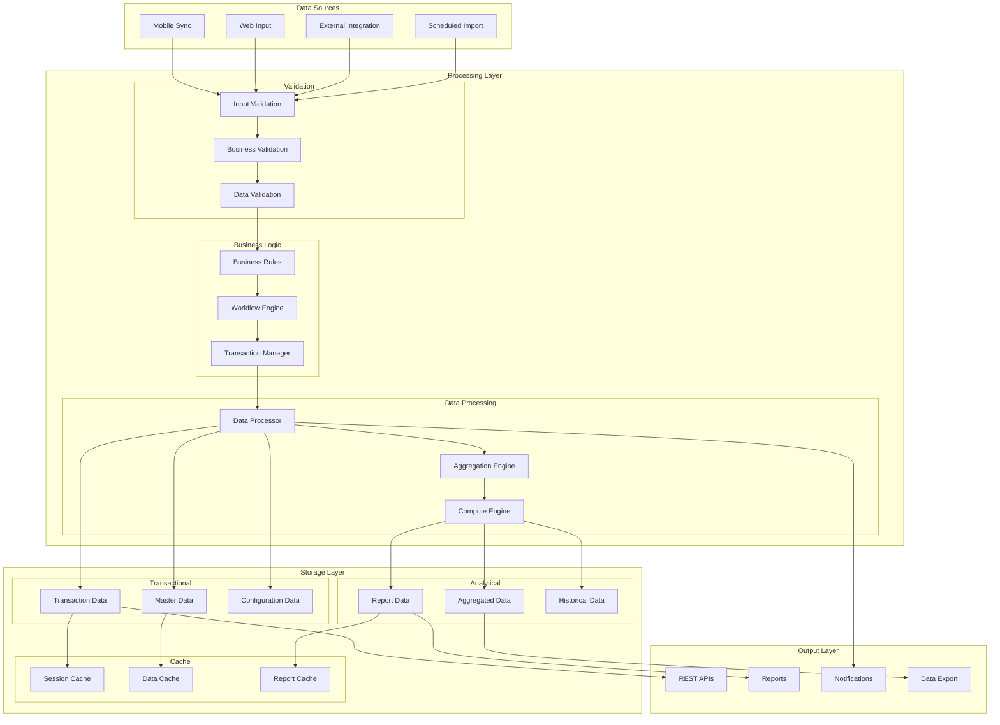
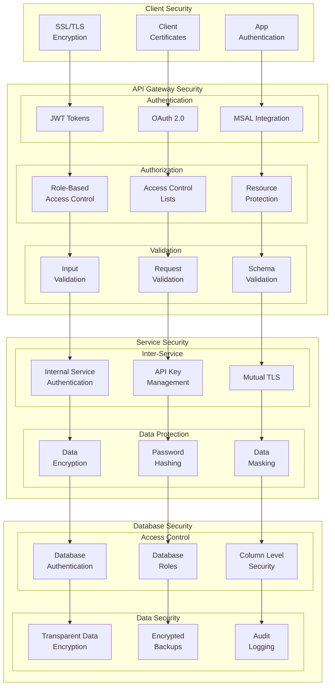
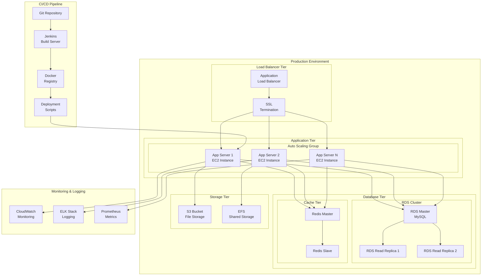
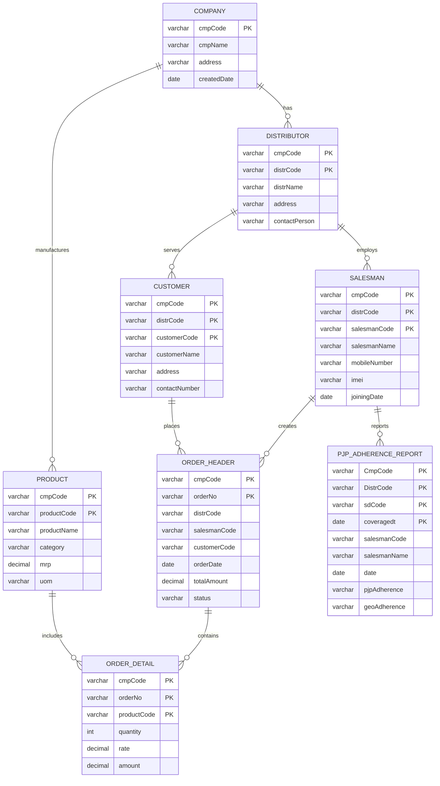
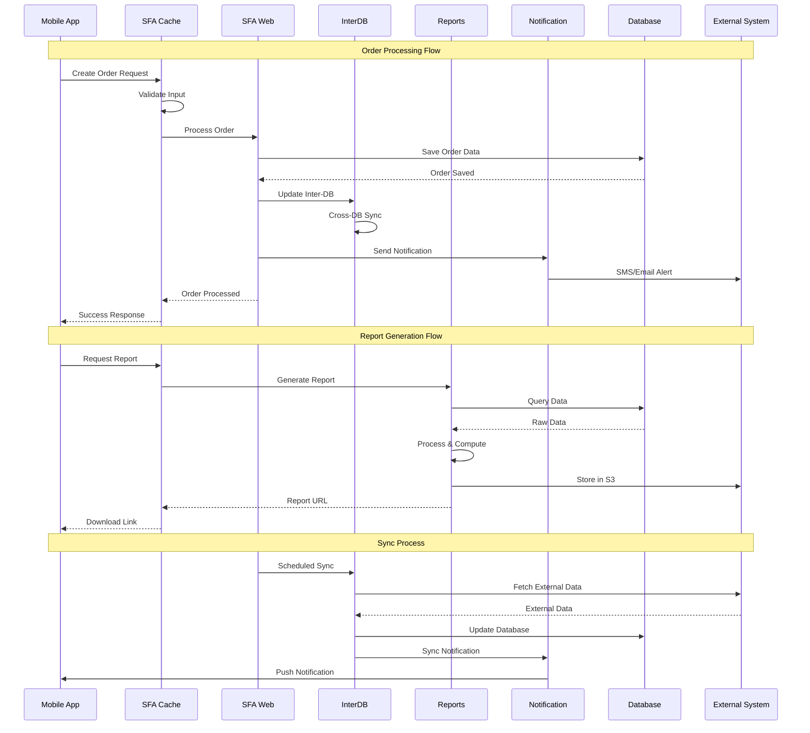
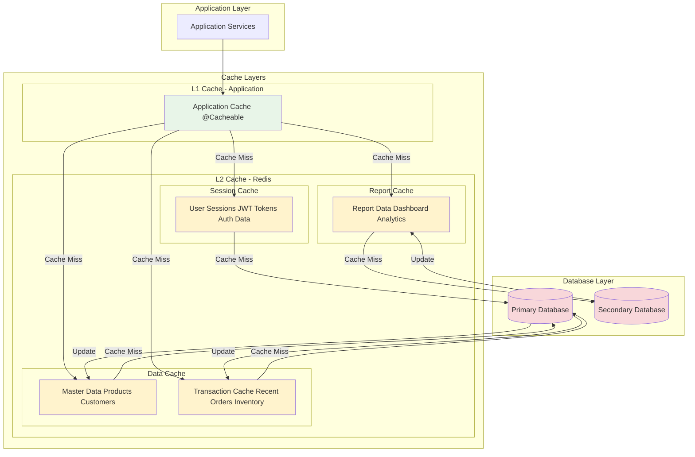

# Marico Supervisor Java - Architecture Diagrams

## 🏗️ System Architecture Diagrams

### 1. High-Level System Architecture

### 2. Microservices Communication Pattern

### 3. Data Flow Architecture

### 4. Security Architecture

### 5. Deployment Architecture

### 6. Database Schema Architecture

### 7. Integration Flow

### 8. Caching Strategy

---

## 📊 Performance Metrics

### Service Response Times
- **SFA Web**: < 200ms (95th percentile)
- **SFA Cache**: < 100ms (95th percentile)
- **Reports**: < 2s (complex reports)
- **Database Queries**: < 50ms (simple), < 500ms (complex)

### Scalability Targets
- **Concurrent Users**: 1000+ active users
- **API Throughput**: 10,000 requests/minute
- **Database Connections**: 100 concurrent connections
- **Cache Hit Ratio**: > 90%

### Availability Targets
- **Uptime**: 99.9% availability
- **Recovery Time**: < 15 minutes
- **Backup Frequency**: Daily automated backups
- **Disaster Recovery**: < 4 hours RTO

---

*These diagrams provide a visual representation of the Marico Supervisor Java architecture. Use them as reference for understanding system interactions and data flows.*