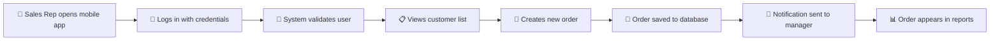

# 🚀 Marico Supervisor Java - Beginner's Guide

## 📚 What is this project?

**Marico Supervisor Java** is a **Sales Force Automation (SFA)** system - think of it as a digital platform that helps sales teams manage their daily activities, track inventory, process orders, and generate reports.

### 🎯 Real-World Example
Imagine you're a sales representative for Marico (a consumer goods company). Instead of using paper forms and manual processes, you use this system to:
- 📱 Take orders from retailers using a mobile app
- 📊 Check product availability and pricing
- 📈 View your sales performance and targets
- 🗺️ Plan your daily route to visit customers
- 📋 Generate reports for your manager

---

## 🏗️ How is the System Built? (Architecture Explained Simply)

### Think of it like a Restaurant Chain 🍕

```
┌─────────────────────────────────────────────────────────────────┐
│                    🏢 RESTAURANT CHAIN                          │
├─────────────────────────────────────────────────────────────────┤
│                                                                 │
│  👥 CUSTOMERS (Users)                                           │
│  ├── Mobile App Users (Sales Reps)                             │
│  ├── Web Portal Users (Managers)                               │
│  └── Admin Users (IT Team)                                     │
│                           │                                     │
│                    🚪 FRONT DOOR                               │
│                    (Load Balancer)                             │
│                           │                                     │
│  🏪 DIFFERENT RESTAURANT BRANCHES (Microservices)              │
│  ├── 🍕 Pizza Branch (SFA Web) - Main orders & customers       │
│  ├── 🍔 Burger Branch (SFA Cache) - Quick service & mobile     │
│  ├── 🥗 Salad Branch (Reports) - Healthy analytics             │
│  ├── 🍰 Dessert Branch (Notifications) - Sweet alerts          │
│  └── 📦 Storage Branch (File Processing) - Document handling   │
│                           │                                     │
│  🏪 SHARED KITCHEN (Common Libraries)                          │
│  ├── 👨‍🍳 Common Recipes (Shared Code)                           │
│  ├── 🥘 Ingredients (Database Models)                          │
│  └── 🔧 Kitchen Tools (Utilities)                              │
│                           │                                     │
│  🏪 STORAGE ROOMS (Databases)                                  │
│  ├── 📊 Main Storage (Primary MySQL) - Orders, customers       │
│  ├── 📈 Analytics Storage (Secondary MySQL) - Reports          │
│  └── ⚡ Quick Access (Redis Cache) - Fast retrieval            │
└─────────────────────────────────────────────────────────────────┘
```

### 🔍 What Each "Branch" (Microservice) Does:

| Service | Port | What It Does | Real-World Example |
|---------|------|--------------|-------------------|
| **SFA Web** | 9003 | Main business operations | Like the main restaurant - handles orders, manages customers |
| **SFA Cache** | 9004 | Mobile app support & caching | Like a drive-through - quick service for mobile users |
| **InterDB** | 9005 | Data synchronization | Like inventory management - keeps all branches in sync |
| **Reports** | 9006 | Generate reports | Like accounting - creates sales reports and analytics |
| **Notifications** | 9009 | Send alerts | Like a messaging service - sends SMS/email updates |
| **File Processor** | 9008 | Handle file uploads | Like document management - processes receipts and forms |

---

## 🛠️ Technology Stack (Explained Simply)

### Programming Language & Framework
```
☕ Java 17 - The main programming language (like the chef's primary skill)
🌱 Spring Boot - The framework that makes development easier (like a recipe book)
🏗️ Gradle - The build tool (like a kitchen manager organizing everything)
```

### Database & Storage
```
🗄️ MySQL - Where we store all data (like a filing cabinet)
⚡ Redis - Fast temporary storage (like a notepad for quick notes)
☁️ AWS S3 - Cloud file storage (like a cloud-based document folder)
```

### Communication
```
🌐 REST APIs - How services talk to each other (like phone calls between branches)
📱 JSON - Data format (like a common language everyone understands)
🔐 JWT - Security tokens (like ID badges for access)
```

---

## 📱 How Does a Typical User Journey Work?

### Scenario: Sales Rep Taking an Order



### Step-by-Step Breakdown:

1. **📱 Mobile App Login**
   - Sales rep enters username/password
   - App sends request to SFA Cache service (Port 9004)
   - System checks credentials in database

2. **👥 Customer Selection**
   - App fetches customer list from cache (fast!)
   - If not in cache, gets from main database
   - Displays customers on mobile screen

3. **🛒 Order Creation**
   - Rep selects products and quantities
   - App validates order (prices, availability)
   - Sends order to SFA Web service (Port 9003)

4. **💾 Data Storage**
   - Order saved to MySQL database
   - Cache updated for quick future access
   - Backup created automatically

5. **📧 Notifications**
   - Notification service (Port 9009) triggered
   - SMS sent to customer confirming order
   - Email sent to manager about new order

6. **📊 Reporting**
   - Report service (Port 9006) processes new data
   - Updates sales dashboards
   - Generates performance metrics

---

## 🚀 Setting Up the Project (Step by Step)

### Prerequisites (What You Need First)

```bash
# 1. Install Java 17
# Download from: https://adoptium.net/
java -version  # Should show version 17

# 2. Install MySQL
# Download from: https://dev.mysql.com/downloads/
mysql --version  # Should show version 8.0+

# 3. Install Redis (Optional for development)
# Download from: https://redis.io/download
redis-server --version

# 4. Install Git
git --version
```

### Step 1: Get the Code
```bash
# Clone the project
git clone https://git-codecommit.ap-south-1.amazonaws.com/v1/repos/maricossfa
cd maricossfa/microservices
```

### Step 2: Set Up Database
```sql
-- Open MySQL and create databases
CREATE DATABASE marico_supervisor_qa;
CREATE DATABASE marico_supervisor_reports;

-- Create a user for the application
CREATE USER 'appuser'@'localhost' IDENTIFIED BY 'your_password';
GRANT ALL PRIVILEGES ON marico_supervisor_qa.* TO 'appuser'@'localhost';
GRANT ALL PRIVILEGES ON marico_supervisor_reports.* TO 'appuser'@'localhost';
```

### Step 3: Configure the Application
```bash
# Copy configuration file
cp config/application.properties config/application-local.properties

# Edit the file and update these settings:
spring.datasource.url=jdbc:mysql://localhost:3306/marico_supervisor_qa
spring.datasource.username=appuser
spring.datasource.password=your_password

# Redis settings (if you have Redis installed)
spring.redis.host=localhost
spring.redis.port=6379
```

### Step 4: Build the Project
```bash
# Make gradlew executable (Linux/Mac)
chmod +x gradlew

# Build all services
./gradlew clean build -x test

# This will:
# - Download all dependencies
# - Compile the code
# - Create executable JAR files
```

### Step 5: Start the Services
```bash
# Start each service in separate terminal windows

# Terminal 1 - Main Web Service
./gradlew :sfaweb:bootRun

# Terminal 2 - Cache Service (for mobile apps)
./gradlew :sfacache:bootRun

# Terminal 3 - Report Service
./gradlew :sfareport:bootRun

# Wait for each service to start (you'll see "Started Application" message)
```

### Step 6: Test the Setup
```bash
# Test if services are running
curl http://localhost:9003/version
curl http://localhost:9004/version

# Expected response:
{
  "appName": "Marico SFA",
  "version": "1.0.0"
}
```

---

## 🔧 Common Development Tasks

### Adding a New API Endpoint

1. **Create Controller Method**
```java
@RestController
@RequestMapping("/api/v1/customers")
public class CustomerController {
    
    @GetMapping("/{id}")
    public ResponseEntity<Customer> getCustomer(@PathVariable String id) {
        // Your logic here
        return ResponseEntity.ok(customer);
    }
}
```

2. **Create Service Method**
```java
@Service
public class CustomerService {
    
    public Customer findById(String id) {
        // Business logic here
        return customerRepository.findById(id);
    }
}
```

3. **Test the Endpoint**
```bash
curl http://localhost:9003/api/v1/customers/CUST001
```

### Adding Database Table

1. **Create SQL Script**
```sql
-- In documents/SFA Web/DBCR-XXX.sql
CREATE TABLE new_table (
    id VARCHAR(50) PRIMARY KEY,
    name VARCHAR(255) NOT NULL,
    created_date TIMESTAMP DEFAULT CURRENT_TIMESTAMP
);
```

2. **Create Entity Class**
```java
@Entity
@Table(name = "new_table")
public class NewEntity {
    @Id
    private String id;
    private String name;
    private Date createdDate;
    // getters and setters
}
```

### Adding Caching

```java
@Service
public class CustomerService {
    
    @Cacheable(value = "customers", key = "#id")
    public Customer findById(String id) {
        // This result will be cached in Redis
        return customerRepository.findById(id);
    }
}
```

---

## 🐛 Troubleshooting Common Issues

### Issue 1: Service Won't Start
```bash
# Check if port is already in use
netstat -tulpn | grep :9003

# Kill process using the port
kill -9 <process_id>

# Or change port in application.properties
server.port=9013
```

### Issue 2: Database Connection Error
```bash
# Check MySQL is running
sudo systemctl status mysql

# Test connection
mysql -u appuser -p -h localhost

# Check configuration in application.properties
spring.datasource.url=jdbc:mysql://localhost:3306/marico_supervisor_qa
```

### Issue 3: Out of Memory Error
```bash
# Increase JVM memory
export JAVA_OPTS="-Xmx2g -Xms1g"
./gradlew :sfaweb:bootRun
```

### Issue 4: Redis Connection Error
```bash
# Check Redis is running
redis-cli ping
# Should return: PONG

# Start Redis if not running
redis-server

# Or disable Redis in application.properties
spring.cache.type=none
```

---

## 📊 Understanding the Data Flow

### When a Mobile User Places an Order:

```
📱 Mobile App
    ↓ (HTTP POST /api/orders)
🔄 SFA Cache Service (Port 9004)
    ↓ (Validates and processes)
🌐 SFA Web Service (Port 9003)
    ↓ (Business logic)
🗄️ MySQL Database
    ↓ (Order saved)
⚡ Redis Cache
    ↓ (Cache updated)
📧 Notification Service (Port 9009)
    ↓ (Sends alerts)
📊 Report Service (Port 9006)
    ↓ (Updates analytics)
✅ Success Response to Mobile App
```

---

## 📚 Learning Resources

### Understanding Spring Boot
- [Spring Boot Official Guide](https://spring.io/guides/gs/spring-boot/)
- [Building REST APIs with Spring Boot](https://spring.io/guides/gs/rest-service/)

### Understanding Microservices
- [Microservices Pattern](https://microservices.io/)
- [Martin Fowler's Microservices Article](https://martinfowler.com/articles/microservices.html)

### Understanding Databases
- [MySQL Tutorial](https://dev.mysql.com/doc/mysql-tutorial-excerpt/8.0/en/)
- [Redis Quick Start](https://redis.io/topics/quickstart)

---

## 🎯 Next Steps for Beginners

1. **Start Small**: Run just one service (sfaweb) first
2. **Explore APIs**: Use tools like Postman to test endpoints
3. **Read the Code**: Start with simple controller classes
4. **Make Small Changes**: Add a simple API endpoint
5. **Learn Gradually**: Understand one microservice at a time
6. **Use Documentation**: Refer to the detailed architecture guide
7. **Ask Questions**: Don't hesitate to reach out to the team

---

## 🆘 Getting Help

### Project Documentation
- `ARCHITECTURE_DESIGN.md` - Detailed technical architecture
- `ARCHITECTURE_DIAGRAMS.md` - Visual diagrams and flows
- `documents/` folder - API specifications and database scripts

### Team Contact
- **Development Team**: Botree Software International Pvt Ltd
- **License**: ©Botree Software International Pvt Ltd. All Rights Reserved

---

*Remember: Every expert was once a beginner. Take your time to understand each concept, and don't try to learn everything at once. Focus on one microservice at a time, and gradually build your understanding of the entire system.*

**Happy Coding! 🚀**